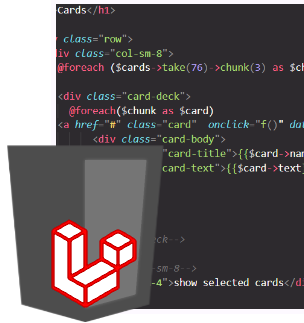

# Card Deck Builder ![badge]

Provides cards from the card game Hearthstone and allows to build and export a deck.

[badge]: https://img.shields.io/badge/status-stable-green.svg

### Features

- Displays all cards from SQL database
- Sort by classes, mana, health attack
- Create, safe and load a deck
- Allows to export the deck to Hearthstone

### Stack
- Laravel
- SQL
- XAMPP

### Preview

